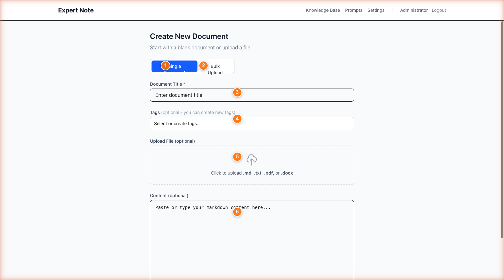
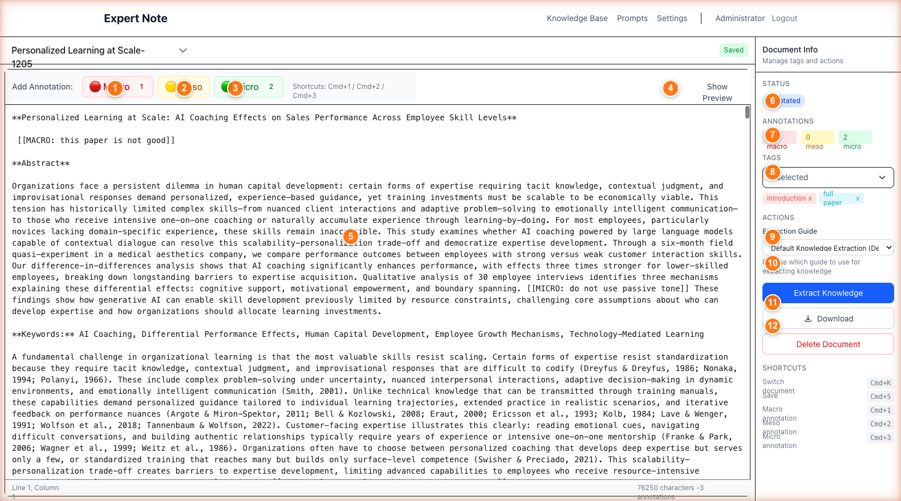
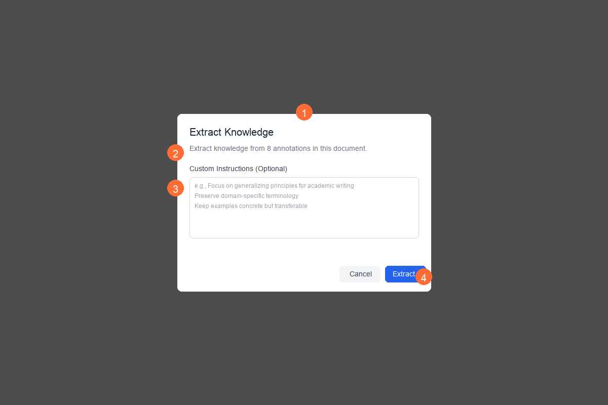
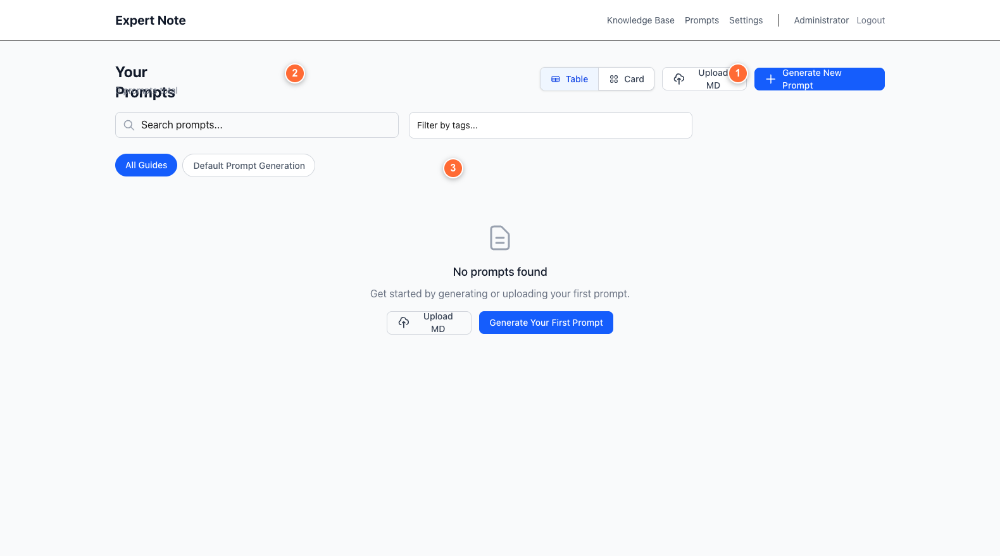
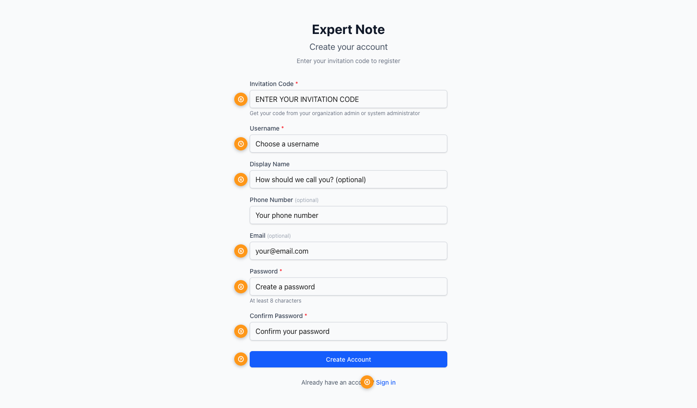

# Expert Note Quick Start Guide

**Transform Human Expertise into AI-Ready Knowledge Assets**

Version 1.0 | January 2026

---

## What is Expert Note?

Expert Note captures **human expert knowledge** and transforms it into **structured, reusable AI assets**:

```
Expert Documents → Structured Annotations → Knowledge Entries → AI Prompts
   (Your PDFs,         (3-level markup)      (Extracted      (Embodied
    Word files)                               insights)       expertise)
```

**The Value:** Convert scattered expert knowledge into organized, AI-ready assets that preserve human insight and context.

---

## The Knowledge Pipeline

### 1. Capture Expert Documents

Upload PDFs, Word docs, or paste text from your domain experts:
- Research papers
- Internal documentation
- Meeting transcripts
- Expert interviews
- Best practices guides


*Upload documents in multiple formats - PDF and DOCX are automatically converted*

---

### 2. Annotate with Three Levels

Mark important content using a **structured 3-level system**:

| Level | Color | What to Mark | Example |
|-------|-------|--------------|---------|
| **MACRO** | 🔴 Red | Big ideas, themes, frameworks | "Machine learning requires three key components..." |
| **MESO** | 🟡 Yellow | Supporting evidence, methods | "The training process uses backpropagation to..." |
| **MICRO** | 🟢 Green | Specific facts, quotes, data | "Accuracy improved from 87% to 94%" |

**Why three levels?** Creates hierarchy that AI can understand - main concepts, supporting ideas, and specific details.


*Annotation buttons (Cmd+1/2/3) and visual markup preserve knowledge structure*

---

### 3. Extract Structured Knowledge

AI analyzes your annotations and creates **knowledge entries**:


*Choose an extraction guide matching your domain (research, business, technical)*

**What AI generates:**
- **Background/Context** - Sets the stage
- **Key Concepts** - Organized by annotation level
- **Relationships** - How ideas connect
- **Actionable Insights** - What experts recommend

Result: **Searchable, reusable knowledge base** instead of buried insights in documents.

---

### 4. Generate AI Prompts (Embodied Expertise)

Turn knowledge into **prompts that embody human expertise**:


*Generate prompts that teach AI to reason like your domain experts*

**Examples:**
- Research assistant that thinks like your senior scientist
- Business analyst with your team's strategic frameworks
- Technical writer matching your documentation standards

**The magic:** AI prompts created from real expert knowledge, not generic templates.

---

## Getting Started

### Register with Invitation Code

Get a code from your organization admin:


*Invitation code determines your role: Owner (full access) or Member (view/edit shared content)*

### Two User Roles

| Role | Can Do | Use Case |
|------|--------|----------|
| **Organization Owner** | Create docs, annotate, extract knowledge, share with team, manage members | Domain experts, researchers, team leads |
| **Organization Member** | View/edit shared docs (if allowed), create personal tags | Team members who consume knowledge |

---

## Key Workflows

### For Organization Owners

**Workflow 1: Capture Expert Knowledge**
1. Upload document (PDF, DOCX, or paste text)
2. Add descriptive tags
3. Click through annotation buttons to mark:
   - MACRO: Main themes (red)
   - MESO: Supporting ideas (yellow)
   - MICRO: Specific details (green)
4. Extract → Choose guide → Generate knowledge entry

**Workflow 2: Create AI Prompt from Knowledge**
1. Go to Prompts page
2. Click "Generate New Prompt"
3. Select knowledge entries as sources
4. Choose generation guide template
5. Add custom instructions
6. Generate → AI creates prompt embodying that expertise

**Workflow 3: Share with Team**
1. Open document
2. Toggle "Share with organization"
3. Set permissions: read-only or allow edits
4. Team members can now access

### For Organization Members

**Workflow 1: Learn from Shared Knowledge**
1. Browse Knowledge Base
2. Search by topic or filter by tags
3. Read extracted insights
4. Reference in your work

**Workflow 2: Contribute to Shared Documents**
1. Open shared document (if edit allowed)
2. Add annotations
3. Suggest improvements
4. Owner can re-extract updated knowledge

---

## Essential Tips

### Annotation Best Practices

✅ **DO:**
- Start with MACRO - identify big ideas first
- Be selective - annotate what's important, not everything
- Keep annotations focused - one concept per annotation
- Use consistent criteria across documents

❌ **DON'T:**
- Annotate every sentence
- Mix multiple ideas in one annotation
- Skip the hierarchy - all three levels matter

### Knowledge Extraction Tips

**Choose the right guide:**
- Academic Research → for papers, studies
- Business Strategy → for frameworks, analysis
- Technical Documentation → for how-to guides
- Default → general purpose

**Add custom instructions to:**
- Focus on specific aspects
- Adjust formality level
- Include domain-specific terminology

### Organizing Your Knowledge Base

**Use tags strategically:**
- **Domain:** machine-learning, marketing, finance
- **Type:** methodology, case-study, best-practice
- **Status:** draft, reviewed, production
- **Project:** project-alpha, q1-2026

**Tag naming convention:** lowercase, hyphenated (e.g., `deep-learning`, `user-research`)

---

## Quick Reference

### Keyboard Shortcuts

| Action | Shortcut |
|--------|----------|
| MACRO annotation | `Cmd+1` |
| MESO annotation | `Cmd+2` |
| MICRO annotation | `Cmd+3` |

### Key Concepts

**Document** → Raw text from experts (PDF, Word, typed)

**Annotation** → Marked sections categorized by importance level

**Knowledge Entry** → AI-extracted structured insights from annotations

**Prompt/Generation Guide** → AI prompt that embodies expert reasoning patterns

**Extraction Guide** → Template that tells AI how to structure knowledge for your domain

---

## Understanding the Value Chain

```
INPUT                    PROCESS                  OUTPUT
───────────────────────────────────────────────────────────────
Expert Document    →    3-Level Annotation   →   Knowledge Entry
(Unstructured)          (Human structure)        (AI-structured)
                             ↓
                        Extract with AI
                             ↓
                    Knowledge Entry      →   Generate Prompt   →   AI Assistant
                    (Organized facts)        (Reasoning pattern)   (Embodied expertise)
```

**Example End-to-End:**

1. **Input:** Upload a senior researcher's 50-page methodology paper
2. **Annotate:** Mark key frameworks (MACRO), validation methods (MESO), specific metrics (MICRO)
3. **Extract:** AI creates knowledge entry: "Research Methodology for User Studies"
4. **Generate:** Create prompt that teaches AI to design studies like your senior researcher
5. **Use:** Your team now has an AI assistant that reasons with expert-level methodology

---

## Common Questions

**Q: Why three annotation levels instead of just highlighting?**
A: Hierarchy teaches AI the difference between main concepts and supporting details - critical for generating coherent prompts.

**Q: Can I annotate documents my team member created?**
A: Yes, if they've shared it with "allow edits" permission.

**Q: What's the difference between Knowledge Entry and Prompt?**
A: Knowledge = extracted facts/insights. Prompt = instructions that teach AI to reason using those facts.

**Q: How many annotations should I add?**
A: Focus on quality over quantity. 5-10 well-chosen annotations per page is better than marking everything.

**Q: Can I extract knowledge without annotations?**
A: The system works best with annotations - they guide AI to focus on what experts consider important.

---

## Next Steps

### First Session (15 minutes)

1. **Upload a document** you know well
2. **Add 10-15 annotations** (mix of MACRO/MESO/MICRO)
3. **Extract knowledge** using default guide
4. **Review the result** - see how AI structured your annotations

### Building Your Knowledge Base (Week 1)

- Annotate 5-10 key documents from your domain
- Extract knowledge from each
- Organize with consistent tags
- Share with your team

### Creating AI Assets (Week 2+)

- Generate your first prompt from knowledge entries
- Test the prompt with real use cases
- Refine based on results
- Build a library of domain-specific prompts

---

## Getting Help

**For Organization Members:**
Contact your organization owner

**For Organization Owners:**
Contact your system administrator

**Technical Issues:**
See the [complete user guide](expert-note-user-guide.pdf) for detailed troubleshooting

---

## Summary: The Expert Note Advantage

Traditional approach:
- Expert knowledge stays in documents
- Hard to search, harder to reuse
- Each person re-learns the same things
- AI doesn't benefit from human expertise

With Expert Note:
- ✅ Expert knowledge becomes searchable assets
- ✅ Structured for both humans and AI
- ✅ Team shares and builds on expertise
- ✅ AI prompts embody real expert reasoning
- ✅ Knowledge compounds instead of scattering

**Start transforming expertise into assets today.**

---

*For detailed features and administration, see the [Complete User Guide](expert-note-user-guide.docx)*
