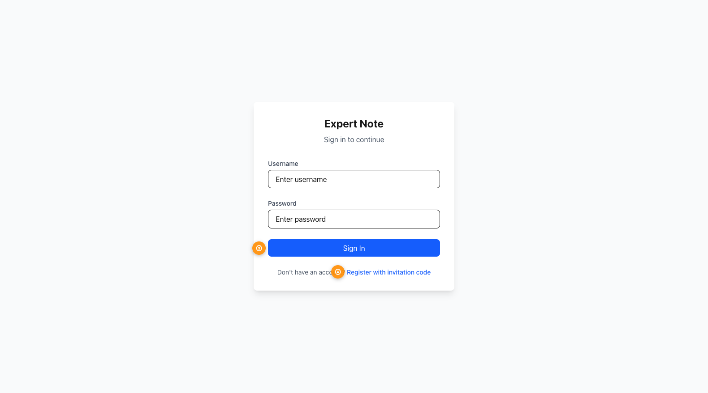
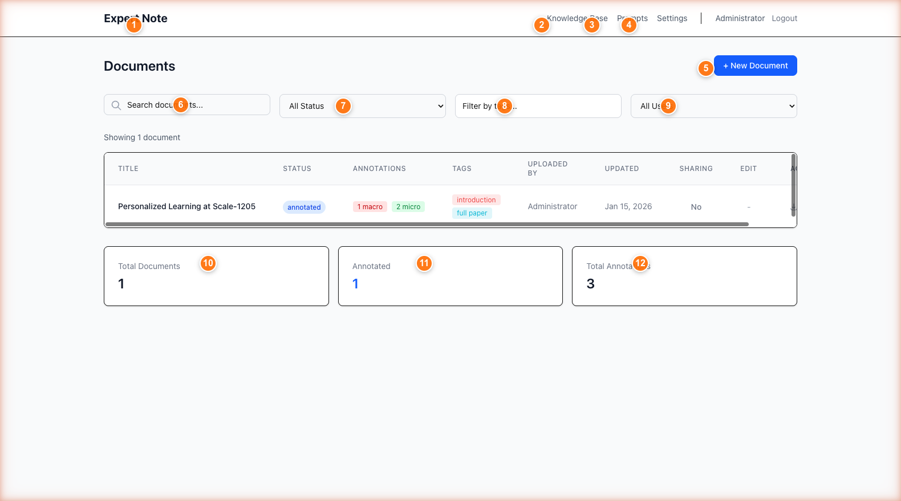
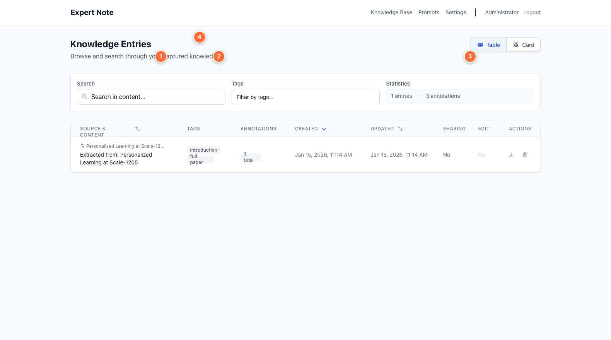
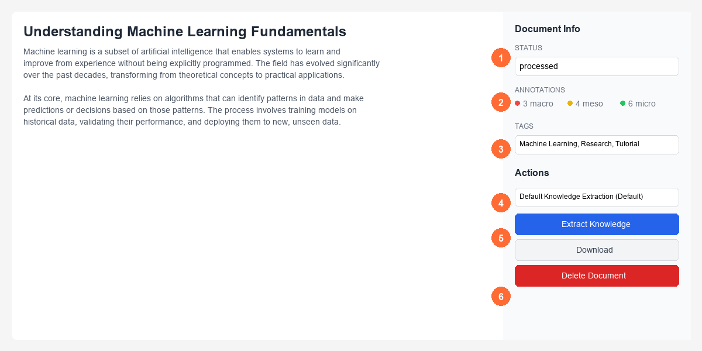
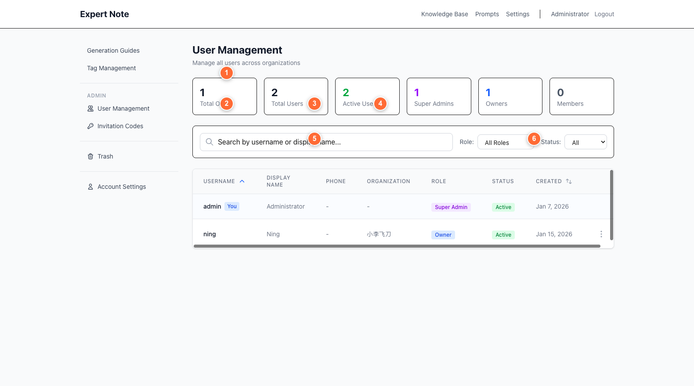
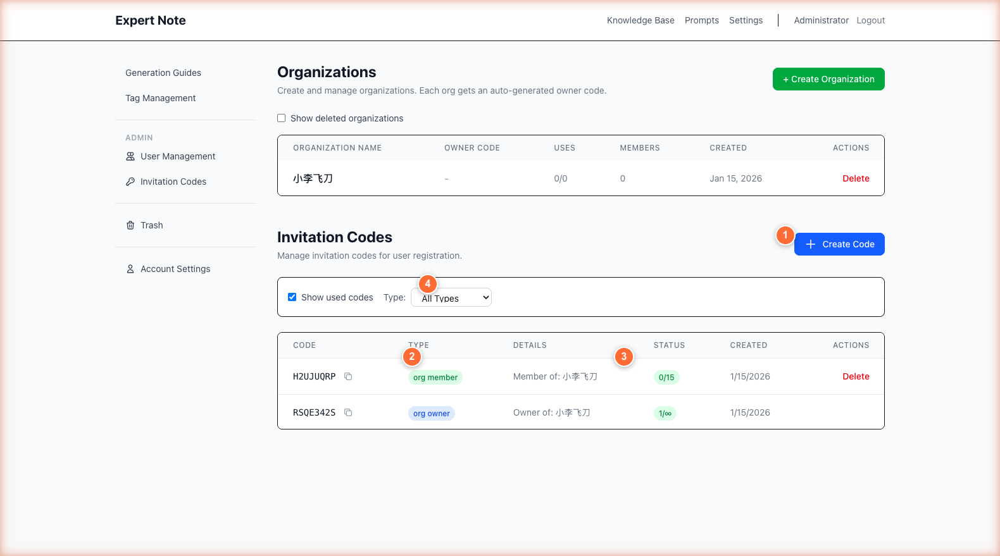
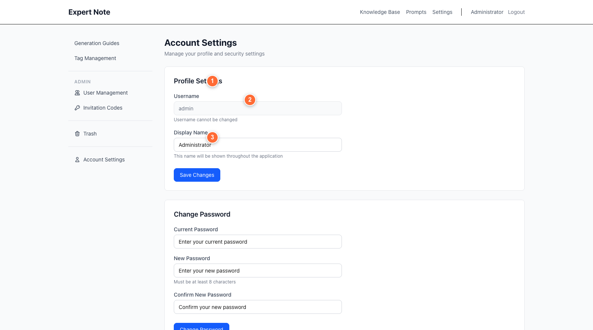
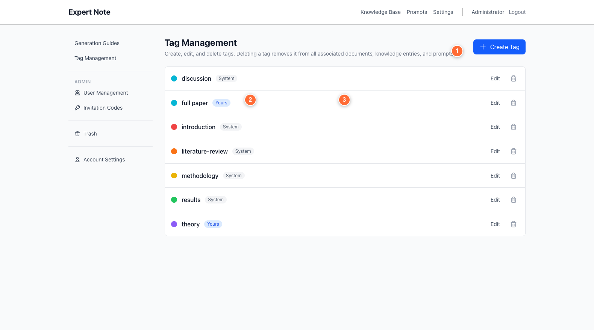
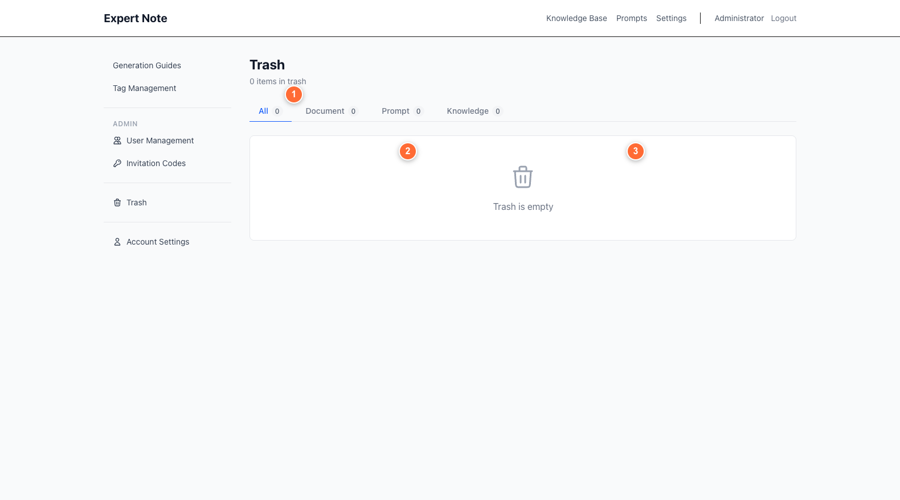

# Expert Note User Guide
**Complete Documentation with Screenshots**

Version 1.0 | January 2026

---

## Table of Contents

- [Getting Started](#getting-started)
- [For Organization Owners](#for-organization-owners)
- [For Organization Members](#for-organization-members)
- [Common Features](#common-features)
- [Quick Reference](#quick-reference)

---

# Getting Started

## What is Expert Note?

Expert Note is an annotation-based knowledge capture system that helps you:
- **Capture** documents from multiple sources (text, PDF, Word)
- **Annotate** content using a structured three-level system
- **Extract** knowledge through AI-powered analysis
- **Collaborate** with your organization members

## Logging In


*Figure 1: Login interface with username (①), password (②), sign in button (③), and register link (④)*

1. Navigate to the Expert Note login page
2. Enter your **username** (①)
3. Enter your **password** (②)
4. Click **Sign In** (③)

**First time user?** Click the "Register with invitation code" link (④) to create an account.

### Troubleshooting Login

**Forgotten password?** Contact your organization owner or system administrator to reset it.

**Account disabled message?** Your account may have been temporarily disabled. Contact your organization owner.

---

## Registration


*Figure 2: Registration form with invitation code (①), username (②), optional fields (③-⑤), and password fields (⑥⑦)*

New users need an **invitation code** from their organization owner or system administrator.

### Registration Steps:

1. **Enter invitation code** (① - Required)
   - Get this from your organization admin
   - Determines if you join as owner or member

2. **Choose a username** (② - Required)
   - Must be unique
   - Used for login

3. **Display name** (③ - Optional)
   - How your name appears to other users
   - Can be changed later in account settings

4. **Phone number** (④ - Optional)

5. **Email address** (⑤ - Optional)

6. **Create password** (⑥ - Required)
   - Minimum 8 characters
   - Must match in both fields

7. **Confirm password** (⑦ - Required)

8. Click **Create Account** (⑧)

---

## Understanding Your Role

Expert Note has three main user roles:

| Role | Access Level | Key Features |
|------|--------------|--------------|
| **Organization Owner** | Full access | Create & share documents, manage members, create invitation codes, extract knowledge |
| **Organization Member** | Limited access | View shared documents, edit if allowed, manage personal tags |
| **System Administrator** | Platform-wide | Manage all organizations, users, and system settings |

Your role determines what features you can access.

---

## Dashboard Overview


*Figure 3: Main dashboard showing navigation (①), new document button (②), search and filters (③-④), and statistics (⑤)*

After logging in, you'll see the main dashboard:

- **① Navigation Menu** (top right): Access Knowledge Base, Prompts, Settings
- **② + New Document Button**: Create a new document
- **③ Search Bar**: Find documents by title
- **④ Filters**: Filter by Status, Tags, or Creator
- **⑤ Document List**: View all your documents
- **⑥ Statistics Cards**: Total documents, annotated count, total annotations

---
---

# For Organization Owners

As an organization owner, you have full access to create, annotate, and share content with your team.

---

## Creating Documents


*Figure 4: Document creation with title field (①), tag selector (②), and upload options (③-④)*

You can create documents in three ways:

### Method 1: Type Content Directly

1. Click **+ New Document**
2. Enter a **title** (①)
3. Select **tags** (②) to organize your document
4. Choose **Type Text** tab (③)
5. Type or paste your content in the editor (④)
6. Click **Save Document**

### Method 2: Upload a File

1. Click **+ New Document**
2. Enter a **title**
3. Select **tags**
4. Choose **Upload File** tab
5. Click **Choose File** or drag and drop
6. Supported formats: `.md`, `.txt`, `.pdf`, `.docx`
7. Click **Save Document**

**PDF/DOCX files** are automatically converted to markdown. You can preview and edit before saving.

### Method 3: Bulk Upload

1. Click **+ New Document**
2. Choose **Bulk Upload** tab
3. Select multiple files (up to 100)
4. Files are processed with automatic titles from filenames
5. Folder structure is preserved

---

## Annotating Documents


*Figure 5: Document editor with annotation buttons (① MACRO, MESO, MICRO), content area, and sidebar properties*

Expert Note uses a **three-level annotation system** to help you categorize information:

### Annotation Levels

| Level | Color | Shortcut | Use For |
|-------|-------|----------|---------|
| **MACRO** | 🔴 Red | Cmd+1 | High-level themes, main arguments, overarching concepts |
| **MESO** | 🟡 Yellow | Cmd+2 | Supporting ideas, evidence, methodologies |
| **MICRO** | 🟢 Green | Cmd+3 | Specific details, quotes, data points, examples |

### How to Annotate

1. Open a document in the editor
2. **Select the text** you want to annotate
3. Click one of the annotation buttons (① MACRO, MESO, or MICRO) or use keyboard shortcuts
4. The text is marked with the appropriate color
5. View annotation counts in the sidebar (②)

**Annotations are saved automatically** as you work.

### Annotation Format

Annotations appear in your document like this:

```markdown
{{{MACRO
This is a high-level theme or main argument.
}}}

{{{MESO
This is supporting evidence or methodology.
}}}

{{{MICRO
This is a specific detail or quote.
}}}
```

---

## Extracting Knowledge


*Figure 6: Knowledge extraction modal with extraction guide selector (①) and custom instructions (②)*

Once you've annotated a document, you can extract structured knowledge using AI.

### Extraction Steps

1. Open an annotated document
2. Click **Extract Knowledge** button (③ in the sidebar)
3. **Select an Extraction Guide** (①) from the dropdown
   - Guides are templates that determine how knowledge is structured
   - Choose based on your domain (e.g., "Academic Writing", "Market Research")
4. (Optional) Add **custom instructions** (②) to guide the AI
5. Click **Extract** button (④)

The AI will:
- Analyze your annotations
- Generate background/context
- Create a structured knowledge entry
- Store it in your Knowledge Base


*Figure 12: Knowledge base with search (①), tag filter (②), view toggle (③), and statistics* to view extracted knowledge.

---

## Sharing Content


*Figure 7: Document properties sidebar showing status (①), annotations (②), tags (③), and sharing controls*

Share documents with your organization members:

### Sharing Steps

1. Open a document you own
2. In the **Document Info** sidebar, find the **Sharing** section
3. Toggle **Share with organization** ON
4. Choose edit permissions:
   - **Read-only**: Members can view but not edit
   - **Allow edits**: Members can make changes

### Important Notes

- Only **organization members** can see shared content
- You can **revoke sharing** at any time
- When you disable sharing, edit permissions are reset to read-only

---

## Managing Members


*Figure 10: User management with search (②), filters (③-④), and user actions (⑥-⑧)*

Organization owners can manage their team members.

### Access Member Management

1. Click **Settings** in the top navigation
2. Choose **Members** from the sidebar

### Member Management Tasks

**View all members:**
- See usernames, display names, roles, last login
- Search by username or display name (②)
- Filter by role or status (③/④)

**Reset a member's password:**
1. Find the member in the table
2. Click **Reset Password** (⑥)
3. A temporary password is shown **once** in a modal
4. Share this password securely with the member
5. They must change it on next login

**Enable/Disable member accounts:**
1. Find the member
2. Click the **Enable/Disable** toggle (⑦)
3. Disabled members cannot log in but data is preserved

**Remove a member:**
1. Find the member
2. Click **Delete** (⑧)
3. Confirm the action
4. Member is **soft deleted** (data preserved, marked as deleted)

---

## Creating Invitation Codes


*Figure 9: Invitation codes section with create button (①), code types (②), and usage tracking*

Generate invitation codes for new members to register.

### Creating a Code

1. Go to **Settings** → **Invitations**
2. Click **+ Create Code** (①)
3. Select **Code Type** (②):
   - **Individual**: Standalone user (no organization)
   - **Organization Member**: Adds user to your organization
4. Set **Usage Limit** (③):
   - **1**: Single-use code
   - **0**: Unlimited uses
5. Click **Create Code**
6. Share the generated code with new members

### Managing Codes

- View all codes in the table (④)
- See usage status (e.g., "2/5" means used 2 times out of 5)
- **Delete unused codes** to keep your list clean
- Filter by type (⑤): Owner / Member / Individual

---
---

# For Organization Members

As an organization member, you can view and interact with content shared by your organization owner.

---

## Your Role as a Member

**What you can do:**
- ✅ View documents shared by your organization
- ✅ Edit shared documents (if owner allows)
- ✅ View knowledge entries and prompts shared with you
- ✅ Create and manage personal tags
- ✅ Manage your account settings

**What you cannot do:**
- ❌ Create new documents
- ❌ Share your own content
- ❌ Manage other members
- ❌ Create invitation codes

---

## Viewing Shared Documents


*Figure 3: Main dashboard showing navigation (①), new document button (②), search and filters (③-④), and statistics (⑤)*

1. Log in to Expert Note
2. The dashboard shows all documents shared with you
3. Use **search** (③) and **filters** (④) to find specific documents

### Document Details

In the document list, you can see:
- Document title
- Status (raw, annotated, refined)
- Tags
- Who created it
- Last updated date
- Whether you have edit permission

---

## Editing Shared Documents


*Figure 5: Document editor with annotation buttons (① MACRO, MESO, MICRO), content area, and sidebar properties*

If the owner has granted **edit permissions**:

1. Click on a shared document
2. Make your changes in the editor
3. Changes are **auto-saved**
4. Your edits are visible to all organization members

**If read-only:** You can view but not modify the content.

---

## Viewing Knowledge & Prompts

### Knowledge Base


*Figure 12: Knowledge base with search (①), tag filter (②), view toggle (③), and statistics*

1. Click **Knowledge Base** in the navigation (①)
2. View all knowledge entries shared with you
3. Search entries (①) by content
4. Filter by tags (②)
5. Switch between **Table** and **Card** view (③)

### Prompts / Generation Guides


*Figure 13: Prompts page with generate button (①), guide selector, and prompts table*

1. Click **Prompts** in the navigation
2. View all generation guides available to you
3. Search prompts (①)
4. Filter by tags (②)
5. Click **Generate New Prompt** (③) if you have permission

---

## Managing Your Account


*Figure 15: Account settings with display name (①), save button (②), and password change (③)*

### Update Your Display Name

1. Go to **Settings** → **Account**
2. Edit the **Display Name** field (①)
3. Click **Save Changes** (②)

### Change Your Password

1. Go to **Settings** → **Account**
2. In the **Change Password** section (③):
   - Enter your current password
   - Enter your new password (8+ characters)
   - Confirm your new password
3. Click **Change Password**

---
---

# Common Features

These features are available to all users (owners and members).

---

## Understanding Annotations


*Figure 5: Document editor with annotation buttons (① MACRO, MESO, MICRO), content area, and sidebar properties*

### Three-Level System

**MACRO (Red 🔴)** - Use for:
- Main themes and arguments
- Research questions
- Overall conclusions
- High-level frameworks

**MESO (Yellow 🟡)** - Use for:
- Supporting evidence
- Methodologies
- Secondary themes
- Analysis sections

**MICRO (Green 🟢)** - Use for:
- Specific quotes
- Data points
- Examples
- Citations
- Technical details

### Best Practices

1. **Start with MACRO**: Identify the big picture first
2. **Add MESO**: Mark supporting ideas
3. **Capture MICRO**: Note specific details
4. **Be selective**: Annotate important content, not everything
5. **Stay consistent**: Use the same level for similar content types

---

## Search and Filtering

### Document Search


*Figure 3: Main dashboard showing navigation (①), new document button (②), search and filters (③-④), and statistics (⑤)*

**Search by title** (③):
- Type keywords in the search bar
- Results update in real-time

**Filter by status** (④):
- All Status
- Raw (not annotated)
- Annotated
- Refined

**Filter by tags** (④):
- Click the tag filter dropdown
- Select one or more tags
- Documents with ANY selected tag are shown

**Filter by creator** (④):
- Filter to see only your documents
- Or documents from specific team members

### Knowledge Base Search


*Figure 12: Knowledge base with search (①), tag filter (②), view toggle (③), and statistics*

- **Search content** (①): Find entries by background or content text
- **Filter by tags** (②): Narrow to specific topics
- **View modes** (③): Switch between Table and Card layouts

---

## Tag Management


*Figure 11: Tag management showing create button (①), tag list (②), and ownership badges*

Tags help you organize documents, knowledge entries, and prompts.

### Viewing Tags

1. Go to **Settings** → **Tags**
2. See all available tags with ownership badges (②):
   - **System** (gray): Built-in tags, cannot be deleted
   - **Yours** (blue): Tags you created
   - **Shared** (green): Tags created by team members

### Creating a Tag

1. Click **+ Create Tag** (①)
2. Enter a **tag name**
3. Choose a **color** from the palette
4. Click **Create**

### Editing Your Tags

1. Find a tag you created (marked "Yours")
2. Click the **Edit** button (③)
3. Change the name or color
4. Click **Save**

### Deleting Tags

- You can only delete tags **you created** (marked "Yours")
- System tags cannot be deleted
- Shared tags can only be deleted by their creator

---

## Trash & Recovery


*Figure 14: Trash page with category filters (①), deleted items (②), and restore actions*

Expert Note uses **soft deletion** - deleted items go to trash and can be restored.

### Viewing Deleted Items

1. Go to **Settings** → **Trash**
2. See all deleted documents, prompts, and knowledge entries
3. Filter by type (①): All / Documents / Prompts / Knowledge

### Restoring Items

1. Find the item in the trash list (②)
2. Click **Restore**
3. Item is moved back to its original location

### Permanently Deleting

**Delete one item:**
1. Find the item
2. Click **Permanently Delete**
3. Confirm the action
4. **This cannot be undone**

**Empty entire trash:**
1. Click **Empty Trash** button
2. Confirm the action
3. All items are permanently deleted

---

## Account Settings


*Figure 15: Account settings with display name (①), save button (②), and password change (③)*

### Profile Information

**Display Name** (①):
- How your name appears to other users
- Can be your real name or a nickname
- Click **Save Changes** (②) after editing

### Password Requirements

When changing your password (③):
- Minimum **8 characters**
- Include letters and numbers (recommended)
- Don't reuse old passwords
- Don't share your password

### Security Tips

- Log out when using shared computers
- Change your password if you suspect it's compromised
- Contact your organization owner if you notice suspicious activity

---
---

# Quick Reference

## Keyboard Shortcuts

| Action | Shortcut |
|--------|----------|
| MACRO annotation | `Cmd+1` |
| MESO annotation | `Cmd+2` |
| MICRO annotation | `Cmd+3` |
| Save document | Auto-save (no shortcut needed) |

---

## Glossary

**Annotation** - Highlighted text marked as MACRO, MESO, or MICRO to categorize information

**Dashboard** - Main page showing your documents and statistics

**Document** - Text file you create, upload, or annotate in Expert Note

**Extraction Guide** - Template that defines how AI structures knowledge from annotations

**Invitation Code** - Unique code for registering new users

**Knowledge Entry** - Structured information extracted from annotated documents

**Organization** - Group of users collaborating together

**Soft Delete** - Items marked as deleted but data is preserved for recovery

**Tags** - Labels to organize and categorize content

**Generation Guide** (also called "Prompt" or "System Prompt") - AI template for creating prompts from knowledge/documents

---

## File Formats Supported

**Upload:**
- Markdown (.md)
- Plain text (.txt)
- PDF (.pdf)
- Microsoft Word (.docx)

**Download:**
- Markdown (.md)

**PDF and DOCX files** are automatically converted to markdown when uploaded.

---

## Getting Help

For technical support or questions:
- **Members**: Contact your organization owner
- **Owners**: Contact your system administrator
- **System issues**: Email support@expertnotesystem.com (replace with actual contact)

---

**Documentation Version:** 1.0
**Last Updated:** January 2026
**For Expert Note Application Version:** Current Production

---

## Screenshot Index

All referenced screenshots with detailed descriptions:

1. [Login Page](screenshots/01-login.md)
2. [Registration Page](screenshots/02-registration.md)
3. [Dashboard Overview](screenshots/03-dashboard.md)
4. [Create Document](screenshots/04-create-document.md)
5. [Document Editor](screenshots/05-document-editor.md)
6. [Knowledge Extraction](screenshots/06-knowledge-extraction.md)
7. [Document Properties & Sharing](screenshots/07-document-properties.md)
8. [Admin Organizations](screenshots/08-admin-organizations.md)
9. [Invitation Codes](screenshots/09-invitation-codes.md)
10. [User Management](screenshots/10-user-management.md)
11. [Tag Management](screenshots/11-tag-management.md)
12. [Knowledge Base View](screenshots/12-knowledge-base.md)
13. [Prompts / Generation Guides](screenshots/13-prompts.md)
14. [Trash & Recovery](screenshots/14-trash.md)
15. [Account Settings](screenshots/15-account-settings.md)

**See the [screenshots folder](screenshots/) for detailed descriptions of each interface element with numbered annotations.**
